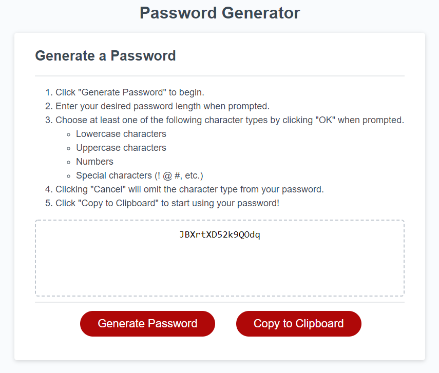

# Password Generator

## Purpose
Creates a randomly generated password given user provided parameters for length and character type.

## Contents
1. [Features](#features)
2. [Website](#website)
3. [Task List](#task-list)
4. [Contribution](#contribution)

## Features
* Allows the user to select a password length between 8 and 128 characters long.
  * Will not allow users to select non-integers.
* Allows the user to select one or more of the following character types:
  * Lowercase characters
  * Uppercase characters
  * Numbers
  * Special characters
* Generated password can be copied to clipboard using the "Copy to Clipboard" button.

## Website

[Deployed Password Generator](https://deckiedevs.github.io/password-generator)

## Task List
- [ ] Create a form for character length and type selection instead of `prompt` and `confirm`.
- [ ] Personalize styles.

## Contribution
- Starter code provided by [UCF Coding Boot Camp](https://github.com/coding-boot-camp/friendly-parakeet).
- Everything else created with enthusiasm by Mila Decker!